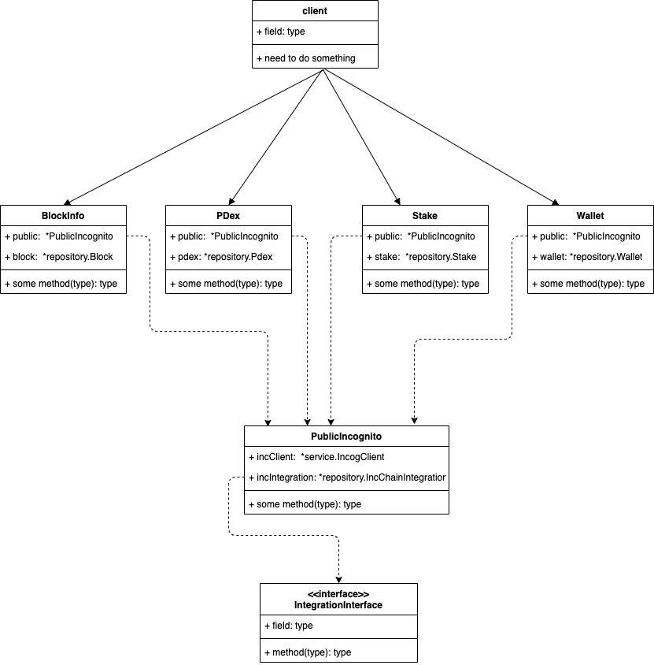

### Incognito SDK

This is SDK support integration with a chain. That mean you creating wallet, sending token, staking node, trading,
etc... with Incognito blockchain.

### Use

Incognito SDK use as library

##### Installation

Using go module

```
go get github.com/incognitochain/go-incognito-sdk@new-tag
```

##### Initialization

Init new PublicIncognito, setup endpoint url environment

Testnet: https://testnet.incognito.org/fullnode

```
client := &http.Client{}
publicIncognito := NewPublicIncognito(client, "https://testnet.incognito.org/fullnode")
```

To create new wallet init new Wallet Object

```
blockInfo := NewBlockInfo(publicIncognito)
wallet := NewWallet(publicIncognito, blockInfo)

//create new wallet
wallet.CreateWallet()

//send token
wallet.SendToken(....)

//get balance
wallet.GetBalance(...)
```

To staking a node

```
stake = NewStake(publicIncognito)

//list unstake
stake.ListUnstake()
//get reward amount of node
stake.GetRewardAmount(
```

To get blockchain info

```
//get blockchain info
blockInfo.GetChainInfo()

//get best block height of chain
blockInfo.GetBestBlockHeight(...)
```

##### All together

```
package main

	import (
		"fmt"
		"github.com/incognitochain/go-incognito-sdk/incognitoclient"
		"github.com/incognitochain/go-incognito-sdk/incognitoclient/entity"
		"net/http"
	)

	func main() {
		client := &http.Client{}
		publicIncognito := NewPublicIncognito(client, "https://testnet.incognito.org/fullnode")

		blockInfo := NewBlockInfo(publicIncognito)
		wallet := NewWallet(publicIncognito, blockInfo)
		
		//create new a wallet
		paymentAddress, pubkey, readonlyKey, privateKey, validatorKey, shardId , _ := wallet.CreateWallet()
		fmt.Println("payment adresss", paymentAddress)
		fmt.Println("public key", pubkey)
		fmt.Println("readonly key", readonlyKey)
		fmt.Println("private key", privateKey)
		fmt.Println("validator key", validatorKey)
		fmt.Println("shard id", shardId)
		
		//send Prv token
		//send prv
		tx, err := wallet.SendToken(
			"112t8s4Pdng512MhHmLVJNYqzoEJQ1TG4XZduvjfwYZFJhmuNtGPhUYRko4jSPFBFmeRg6bumKQuhAEMriQ72cpp5SKAkRuXfLCv5xeZx3f5",
			"12Rsf3wFnThr3T8dMafmaw4b3CzUatNao61dkj8KyoHfH5VWr4ravL32sunA2z9UhbNnyijzWFaVDvacJPSRFAq66HU7YBWjwfWR7Ff",
			publicIncognito.GetPRVToken(),
			500000000000,
			5,
			"",
		)

		if err != nil {
			fmt.Println(err.Error())
			return
		}

		fmt.Println(tx)
		
		amountPrv, err := wallet.GetBalance("112t8s4Pdng512MhHmLVJNYqzoEJQ1TG4XZduvjfwYZFJhmuNtGPhUYRko4jSPFBFmeRg6bumKQuhAEMriQ72cpp5SKAkRuXfLCv5xeZx3f5", publicIncognito.GetPRVToken())
		fmt.Println(amountPrv)
	}
```

### How to works

Incognito SDK wrap all RPC of blockchain, build raw data at device local before call rpc because maybe have issue when send private key to FullNode

The steps:

1. Build raw data at device local
2. Call RPC with raw data
3. Get result

UML Diagram



### Godoc

- With Docker

```
    docker build -t godoc-sdk .
    docker run -p 6060:6060  --name godoc-sdk  godoc-sdk
```

- Without Docker

```
godoc -http=:6060
```

Access endpoint

http://localhost:6060/pkg/github.com/incognitochain/go-incognito-sdk/incognitoclient
